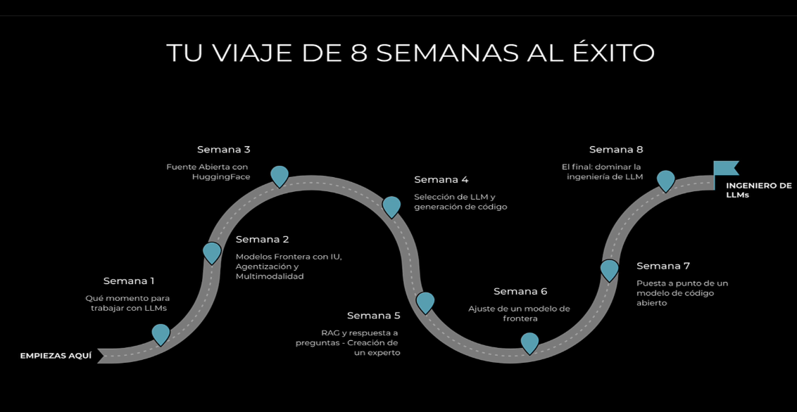

# Temas a tratar


## Como subiras de nivel en la semana 1
Comprenderas los modelos de Frontier y sus APIS y habras programado tus propias soluciones:

-   Inicio
-   Dia 1(Hoy) : Tuprimera solucion LLM desde 0
-   Dia 2 : La mejor posicio para el exito en 8 semanas
-   Dia 3 : Estado del arte: Comparacion de modelos fronterizos
-   Dia 4 : Transformers
-   Dia 5 : Una solucion potente en cuestion de minutos
-   Dia 6 : Tu primer solucion empresariar, aplicada al dia de hoy

## Entorno para desarollar tu primer producto LLM
-1. Paso 1: Clonar el repositorio desde github
-2. Paso 2: Seguir el README: Recomendado crear un entorno de anaconda, Alternativa: Utilizar un entorno virtual de Python y pip
-3. Paso 3: Crear una clade de OpenIA
-4. Paso 4: Crear el fichero .env

## Como activar el entorno de anaconda
```bash
conda activate base
```

## Como inicializar anaconda navigator
```bash
anaconda-navigator
```
### Cargar jupyter notebook
```bash
jupyter notebook --no-browser
```

## Clonar el repositorio de git 
```bash
git clone https://github.com/ed-donner/llm_engineering.git
```

## Crear un entorno de anaconda
```bash
conda env create -f environment.yml
```
## Activar el entorno de anaconda
```bash
conda activate llms
```
## Desactivar el entorno de anaconda
```bash
conda deactivate
```

## Activar jupyter lab
```bash
jupyter lab
```
